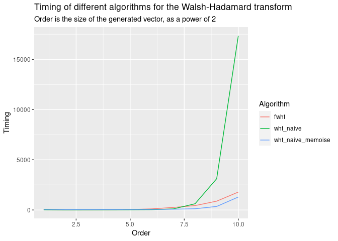

<!-- README.md is generated from README.Rmd. Please edit that file -->

# FWHT

A very simple, purely **R** based implementation of the Fast
Walsh-Hadamard algorithm. I found many implementations on the internet,
but felt that all of them were quite opaque - I chose to re-implement
the algorithm using a more functional style (recursion). I recognize
that this is probably slower than the usual in-place rotation (that most
people seem to be using), especially with **R**s lack of tail-call
optimization. Nonetheless, I think the implementation is quite
illustrative, and simple.

The implementation boils down to:

``` r
fwht <- function( x )
{
  if(length(x) == 1) return(x) 
  upper = x[1:(length(x)/2)]
  lower = x[((length(x)/2)+1):length(x)]

  a = upper + lower
  b = -lower + upper

  return(c(fwht(a),fwht(b)))
}

fwht( c(1,0,1,0,0,1,1,0) )
#> [1]  4  2  0 -2  0  2  0  2

fwht(c(1,0,0,1))
#> [1] 2 0 0 2
```

Note that this does no normalization nor sequency ordering.

I benchmark this against the ‘naive’ approach of multiplying by a
Hadamard matrix. I also benchmark (both approaches) against the naive
approach using memoisation implemented via ‘memoise’. I think such
comparison is interesting because there are cases where memoisation
**IS** faster than using the algorithm above (though not by much).

    #> Loading required package: reshape2
    #> Loading required package: microbenchmark
    #> Loading required package: memoise
    #> Loading required package: ggplot2

<!-- -->

Note that the whole benchmark and implementation is contained in
**fwht.R**

## Vs Rcpp/C++

I felt an itch to compare the performance against a C++ implementation.
I rewrote the algorithm using the awesome **Eigen** library, but kept to
the spirit of the original implementation (simple recursion, no evil
pointer magic or bit hacks).

The results show that doing this does not add very much - there is a
speedup, even a statistically significant one, but not a several fold
speedup.

<!-- -->

The C++ code is hidden in **fwht\_cpp.cpp**, and should compile right
away using **Rcpp::sourceCpp()**, the comparison benchmark is in
**cpp\_test.R**, which is mostly a copy of **fwht.R**, primarily to be
runnable “as is”.

(**NOTE**: For the C++ code, you will need Rcpp and RcppEigen (and
obviously a C++ compiler). Nonetheless, there is no actual Rcpp class or
method used, so the code should compile elsewhere with Eigen being the
only dependency. )
